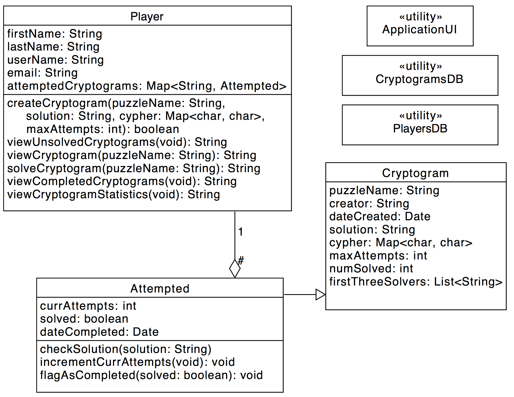
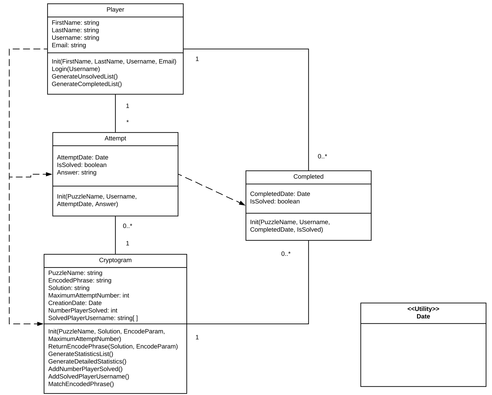
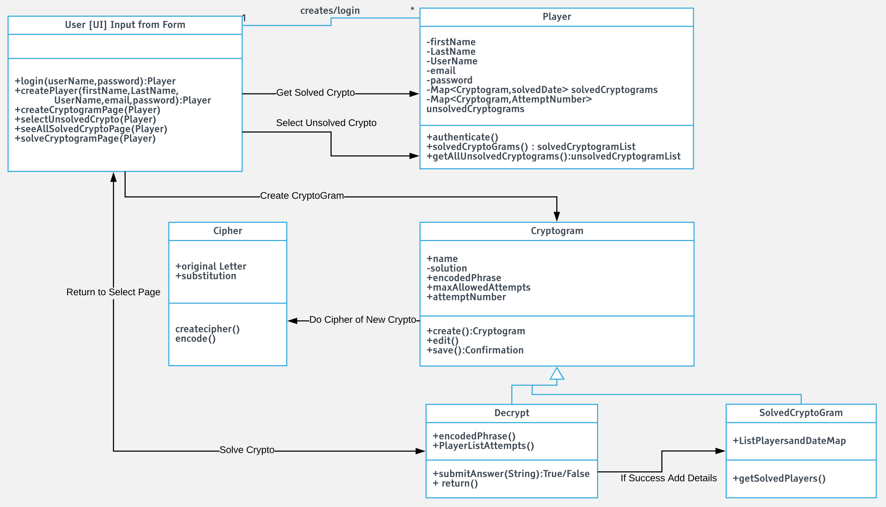
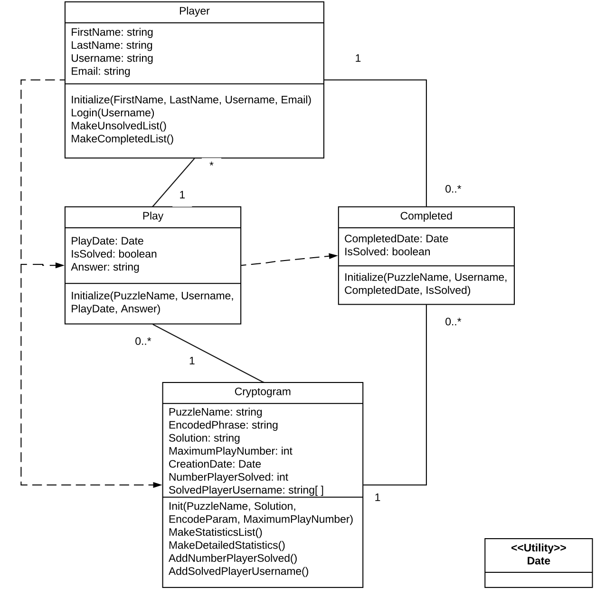

# Design Discussion

## Design 1 (Robert Johns)

**Pros**

* Very simple, only three classes

* Relationships between classes are clear and straightforward

**Cons**

* Cypher as a Map, not its own class, means less modularity and flexibility for future development

* Classifying all completed cryptograms for a player as attempted cryptograms has potential for confusion

## Design 2 (Zhen Tan)

**Pros**

* Having completed cryptograms be their own class is a much cleaner solution than Robert's- leaves no question as to which group an attempted cryptogram belongs.

**Cons**

* GenerateStatisticsList() is probably not a function done for a single cryptogram, but by whatever data structure (database, container class) stores all cryptograms at large.

## Design 3 (Ayush Seth)

**Pros**

* Lots of good detail on each class's relationship with the UI. Will come in handy when the construction phase starts.

* Small number of classes and straightforward descriptions of the relationships between those classes.

**Cons**

* UI information is a little extraneous at this point. We should save for later.

## Design 4 (Xupin Zhang)

**Pros**

* Xupin's is very similar to Zhen's, and as such shares many of the same pros and cons.

**Cons**

* Xupin's is very similar to Zhen's, and as such shares many of the same pros and cons.

## Team Design

Fortunately, all of our designs were very similar. As such, we simply took the best parts of each diagram (Ayush's Cypher class, Xupin & Zhen's Completed class) and merged them into one seamless structure. Fortunately, as our diagrams were so similar, they are very compatible and such a merging was very easy.

Going off of Robert's as the basis (it was the smallest and simplest), we decided to add in the Cypher class from Ayush's diagram, allowing us to modify how Cyphers work without changing unrelated classes for future development, and add the Completed class from Xupin's and Zhen's diagrams, allowing each player to store both different types of Cryptogram, which serve different purposes. This should also make searching and statistics algorithms easier to implement, without an effect on memory.

## Summary

Our group video conference was quick and productive, we seem to mesh well together and are all willing to pull our share. In terms of design, we learned how straightforward UML design can be when all parties are starting on essentially the same page. In addition, we decided, when in doubt, to go for modularity and specificity of purpose in our classes, rather than strictly limiting the number of classes as much as possible.

## Changelog

6/21/2018 9:00pm: Robert

