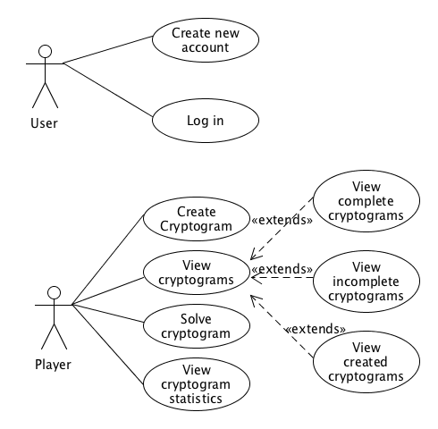

# Use Case Model

**Author**: Team 13

## 1 Use Case Diagram

## 2 Use Case Descriptions

**Create new account:**

- **Requirements**: This use case must allow a user (distinct from a player) to create a new account (thus becoming a player), in order to create and solve cryptograms
- **Pre-conditions**: The user must not be logged in already, and must be on the main screen/activity of the app and select "Create Account" from the menu.
- **Post-conditions**: Once an account is created successfully, the user must be logged into his/her new account and shown the menu of options for a player.
- **Scenarios**: This use case can only occur when a user is not logged in and is on the main menu. This could occur directly on opening the app or after a player has logged out.

**Log in:**

- **Requirements**: This use case must allow a user to log into an existing account.
- **Pre-conditions**: The user must not be logged in already, and must be on the main screen/activity and select "Log In" from the menu
- **Post-conditions**: Once successfully logged in, the user must be logged into his/her existing account and shown the menu of options for a player.
- **Scenarios**: This use case can only occur when a user is not logged in and is on the main menu. This could occur directly on opening the app or after a player has logged out.

**Create Cryptogram:**

- **Requirements**: This use case allows a logged-in player to create a new cryptogram
- **Pre-conditions**: The player must be logged in, must be on the main menu for a player, and must select "Create Cryptogram"
- **Post-conditions**: Once a cryptogram is successfully created, any player should be able to view, access and attempt to solve the new cryptogram.
- **Scenarios**: This use case can only occur when a player is logged in.

**View Cryptograms:**

- **Requirements**: This use case allows a user to view existing cryptograms in the system, be they solved or unsolved by the player.
- **Pre-conditions**: The player must be logged in, must be on the main menu for a player, and must select "View Cryptograms"
- **Post-conditions**: The player must be shown a menu of what types of cryptograms to view: completed, incomplete, and created
- **Scenarios**: This use case can only occur when a player is logged in.

**View Completed Cryptograms:**

- **Requirements**: This use case allows a user to view all cryptograms he/she has completed, either successfully or unsuccessfully
- **Pre-conditions**: The player must be logged in, must be on the "View Cryptograms" menu, and must select "View Completed Cryptograms"
- **Post-conditions**: The player must be shown a list of all cryptograms he/she has either solved or run out of attempts
- **Scenarios**: This use case can only occur when a player is logged in and is on the "View Cryptograms" menu

**View Incomplete Cryptograms:**

- **Requirements**: This use case allows a user to view all cryptograms he/she has not completed
- **Pre-conditions**: The player must be logged in, must be on the "View Cryptograms" menu, and must select "View Incomplete Cryptograms"
- **Post-conditions**: The player must be shown a list of all cryptograms he/she has not solved
- **Scenarios**: This use case can only occur when a player is logged in and is on the "View Cryptograms" menu

**View Created Cryptograms:**

- **Requirements**: This use case allows a user to view all cryptograms he/she has created
- **Pre-conditions**: The player must be logged in, must be on the "View Cryptograms" menu, and must select "View Created Cryptograms"
- **Post-conditions**: The player must be shown a list of all cryptograms he/she has created
- **Scenarios**: This use case can only occur when a player is logged in and is on the "View Cryptograms" menu

**Solve Cryptogram:**

- **Requirements**: This use case allows a user to attempt to solve a single cryptogram puzzle
- **Pre-conditions**: The player must be logged in, must be on the main menu for a player, and must select "Solve Cryptogram"
- **Post-conditions**: Once a player completes an attempt to solve the cryptogram, the app will indicate if the cryptogram was solved successfully, and return the player to the main menu for a player
- **Scenarios**: This use case can only occur when a player is logged in and is on the main menu

**View Cryptogram Statistics:**

- **Requirements**: This use case allows a user to view the statistics for all cryptograms in the system
- **Pre-conditions**: The player must be logged in, must be on the main menu for a player, and must select "View Cryptogram Statistics"
- **Post-conditions**: The player is shown a list of all cryptograms in the system, complete with all relevant statistics for that cryptogram
- **Scenarios**: This use case can only occur when a player is logged in and is on the main menu
